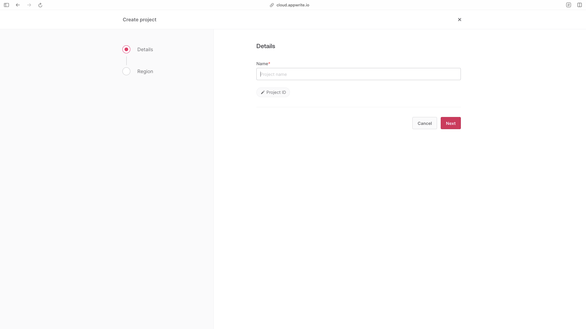
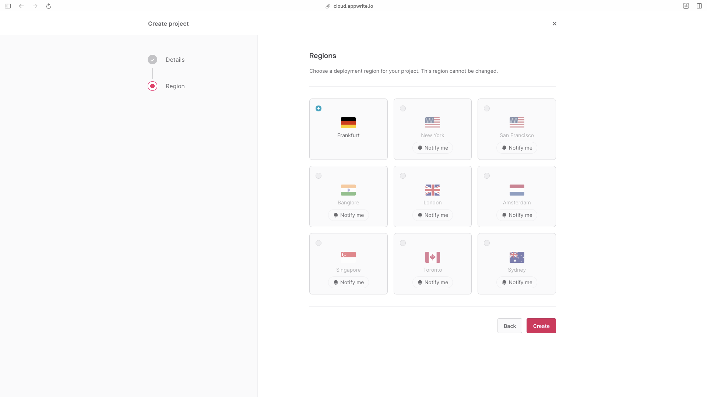
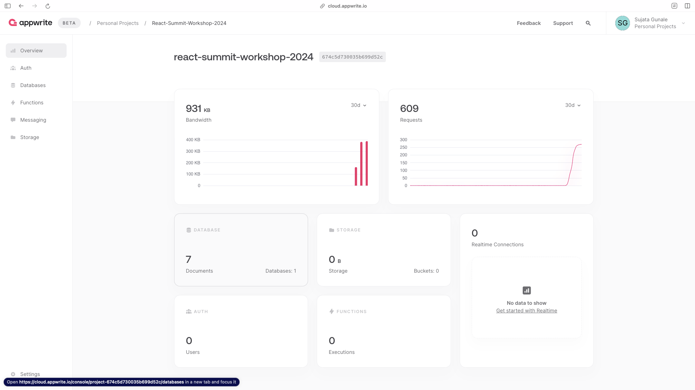
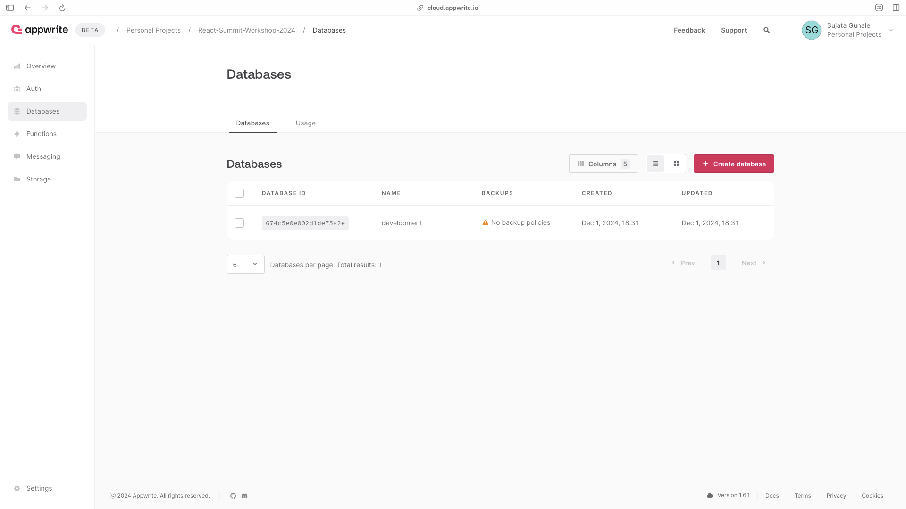
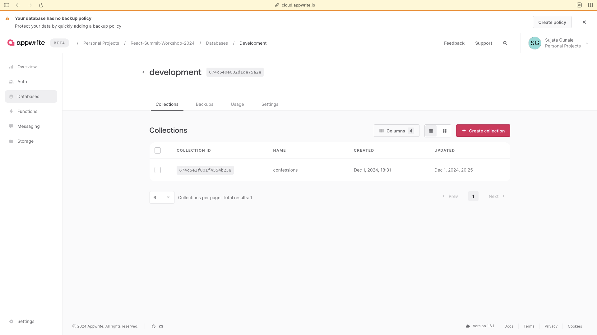
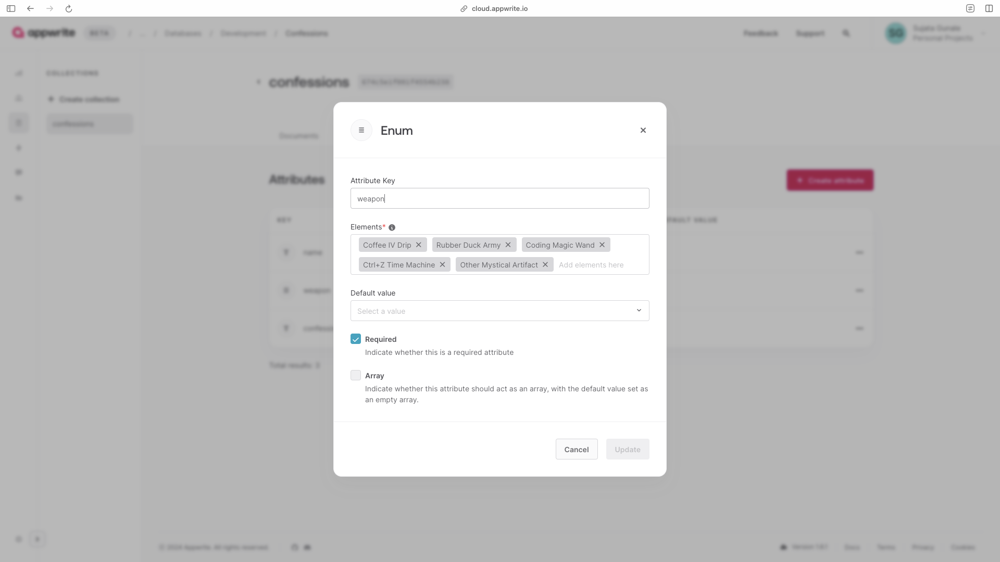
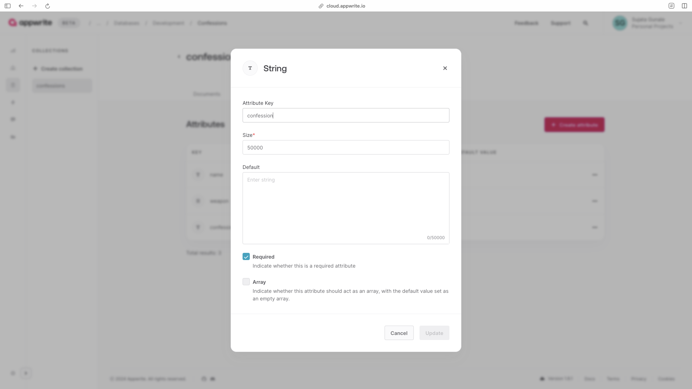
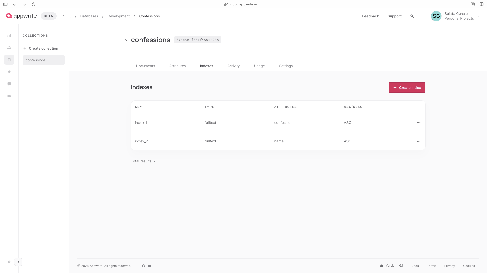
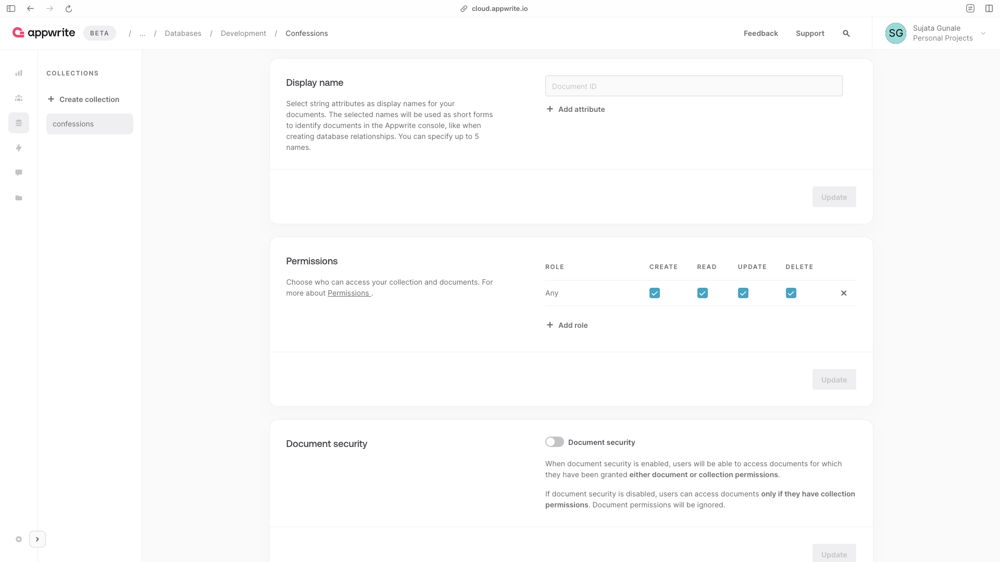
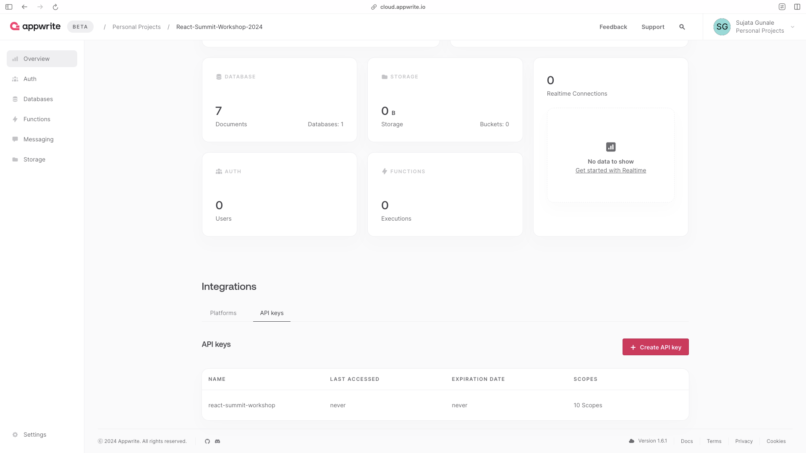

This is a [Next.js](https://nextjs.org) project bootstrapped with [`create-next-app`](https://nextjs.org/docs/app/api-reference/cli/create-next-app).

## Getting Started

First, run the development server:

```bash
npm run dev
# or
yarn dev
# or
pnpm dev
# or
bun dev
```

Open [http://localhost:3000](http://localhost:3000) with your browser to see the result.

You can start editing the page by modifying `app/page.tsx`. The page auto-updates as you edit the file.

This project uses [`next/font`](https://nextjs.org/docs/app/building-your-application/optimizing/fonts) to automatically optimize and load [Geist](https://vercel.com/font), a new font family for Vercel.

## Appwrite

We're using [Appwrite](https://appwrite.io) for quick bootstrapping of a database for this project. To setup the database, follow below instructions:

- Create Your Account on [Appwrite](https://appwrite.io)
- Visit [Appwrite Cloud](https://cloud.appwrite.io/console/organization-65313bd9338bbe523bf3)
- Create a new Project
  
- Select region of your Project
  
- After successful creation of Project, you'll be redirected to the created Project Overview dashboard. Copy the Project ID
  
- Create a new Database and Copy the Database ID
  
- Next, create a new Collection and Copy the Collection ID
  
- A collection is a list of documents. You can think of it like a table in a database. You can add, update, and delete documents in a collection. So let's define our collection schema
  - First, we'll need name of the confession
    
  - Second, we'll need weapon of the confession as an Enum
    
  - Lastly, we'll need confession of the confession
    
- We'll also implement search functionality to search for confessions based on the name of the confession or the confession itself. So in Appwrite, we'll have to index the name and confession attributes
  
- Appwrite has lots of other features such as backup policies or permissions. By default, permissions are set to private so we'll need to change that to public. So go to the settings of created Collection and set Permissions to any
  
- Finally, we'll need API key to perform actions on Appwrite database through it's Node SDK. This is only needed if you're going to use Appwrite on backend. So let's create a new API key
  
- Copy the API key, database ID, collection ID and paste them in `.env.local` file in this format
  ```bash
    APPWRITE_NODE_API_KEY=
    APPWRITE_PROJECT=
    APPWRITE_DATABASE=
    APPWRITE_COLLECTION=
    APPWRITE_ENDPOINT=https://cloud.appwrite.io/v1
  ```

## Learn More

To learn more about Next.js, take a look at the following resources:

- [Next.js Documentation](https://nextjs.org/docs) - learn about Next.js features and API.
- [Learn Next.js](https://nextjs.org/learn) - an interactive Next.js tutorial.

You can check out [the Next.js GitHub repository](https://github.com/vercel/next.js) - your feedback and contributions are welcome!

## Deploy on Vercel

The easiest way to deploy your Next.js app is to use the [Vercel Platform](https://vercel.com/new?utm_medium=default-template&filter=next.js&utm_source=create-next-app&utm_campaign=create-next-app-readme) from the creators of Next.js.

Check out our [Next.js deployment documentation](https://nextjs.org/docs/app/building-your-application/deploying) for more details.
